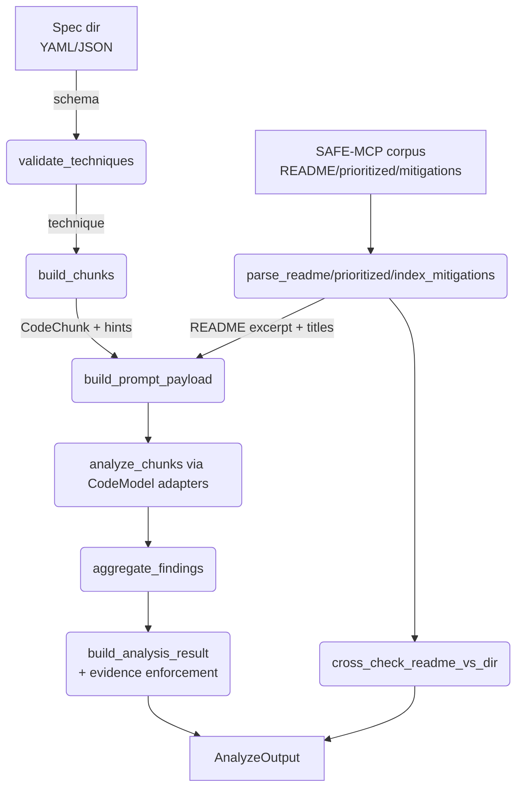
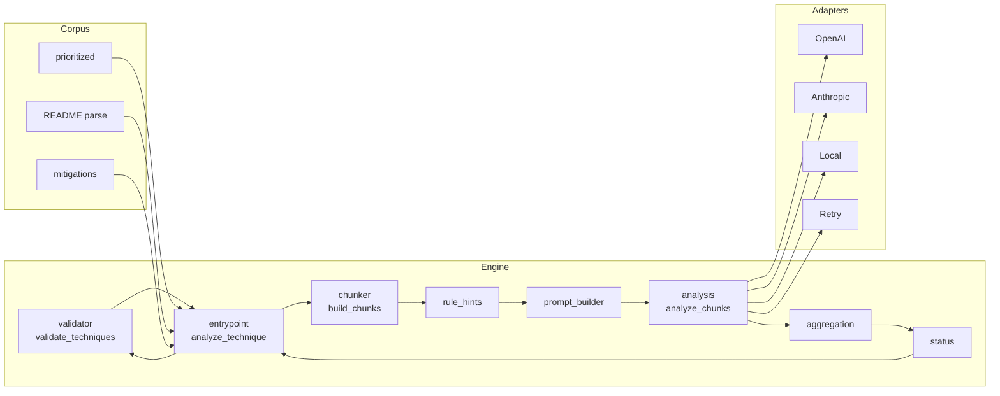

# SAFE-MCP Scanner Architecture

## Overview
- Rust workspace with CLI + MCP server that scan repositories against SAFE-MCP techniques.
- Engine consumes machine-readable technique specs plus the vendored SAFE-MCP corpus (`safe-mcp/`) for README guidance and mitigation metadata (corpus kept gitignored).
- Path filters support include/exclude globs/exts and optional `max_file_bytes`; docs/manifests are allowed by default. Optional LLM review can post-filter findings; failures are non-fatal.
- Model adapters (remote and local) analyze code chunks; aggregation and status logic produce structured results with mandatory evidence.

## Core Flow
1. **Load & Validate**: `validate_techniques` reads YAML/JSON specs from the spec directory using the JSON schema, returning typed techniques and parse errors.
2. **Reference Data**: `parse_prioritized_techniques`, `parse_readme_techniques`, and `index_mitigations` pull ordering, technique names, and mitigation titles from `safe-mcp/`. Entry-point treats IO/parse errors as fatal.
3. **Chunking & Hints**: `build_chunks` walks the target repo (scope-aware) with path filters (globs/exts/size); docs/manifests are included unless explicitly excluded. It splits files into `CodeChunk`s; `apply_rule_hints` attaches regex/string matches from technique code signals.
4. **Prompting & Models**: `build_prompt_payload` assembles technique summary, mitigations, README excerpt, rule hints, file path/extension/line range, and code chunk. `CodeModel` adapters (OpenAI, Anthropic, Local, Retry wrapper) process each chunk via `analyze_chunks` with temperature pinned to 0.
5. **Aggregation & Status**: `aggregate_findings` merges overlapping findings (max severity retained). `build_analysis_result` enforces evidence presence and computes status; info-only findings yield `Pass` with an informational summary.
6. **Entrypoint**: `analyze_technique` wires the above, returning `AnalyzeOutput` with analysis, cross-checks (README vs filesystem missing/extra techniques), and mitigation titles. Schema path is provided by caller; missing technique README is treated as fatal.

### Flow Diagram

## Components
- **engine/**: loaders, validators, chunker, rule hints, prompt builder, adapters trait, analysis runner, aggregation, status, entrypoint.
- **adapters/**: provider implementations (OpenAI, Anthropic, Local) plus Retry wrapper; uses `reqwest` with rustls; async via `tokio`.
- **schemas/**: JSON schema for techniques; referenced by validation.
- **safe-mcp/** (gitignored): reference corpus with technique READMEs, prioritized list, mitigations.

### Component Relationships

## Error Handling & Evidence
- Metadata and schema IO/parse errors are surfaced (no silent fallbacks). Missing technique README is fatal for prompting.
- Findings without evidence (file, line range, snippet) cause analysis failure to preserve traceability.

## Current Deliverables
- **CLI (`safe-mcp-scan`)**: parses args, calls `analyze_technique`, emits JSON; optional `--llm-review` post-filters findings (non-fatal on failure); schema path flag for out-of-repo runs.
- **MCP Server**: tools for listing techniques, scanning a technique, and explaining findings; reuses the engine entrypoint and path resolution layer.
- **Batch scans**: `run_scans.sh` runs all specs under `techniques/`, continuing on failures and writing per-technique JSON outputs.

## Testing Baseline
- Unit tests cover loaders/validators, chunking, rule hints, prompt builder, adapters trait plumbing, aggregation, status, and metadata parsers.
- Integration tests to add once CLI/server land, using fixtures under `tests/fixtures/` and stub model adapters for deterministic runs.
